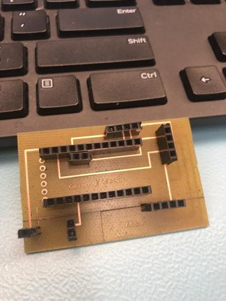

Nov 21st(Week 11 Enclosure due): As shown below, I was able to make my enclosure for my PCB. It was made in the prototype lab using clear acrylic.
            
            
The link for the design file is available here: 
            https://github.com/kwitaszek/SmartWatch/blob/master/Documentation/Pedometer%20case.cdr

Nov 12th(Week 10 Progress Report): As shown in class, I wass successfully able to display my sensor readings on my OLED screen.
            
Budget: Had to purchase a new bluetooth module HM-18 as my previous chip got damaged while I was working on it.

Schedule: I should be able to keep up with the schedule but on some weeks I might have to go to the Thursday class due to time constraints on the weekend and a filled schedule on Monday.

List of things that still need work on:
1. Making the acrylic case for my PCB which is due on Week 11.
2. Making the PCB run from an external power source. Up until now, I was able to run everything using power from my USB TTL Adapter which was used to connect my arduino to my PC. When I connect my external power source, it doesnt work properly as it shows random pixels on the screen, I hope to have this fixed hopefully by next week.
3. Start work with the Bluetooth module so that I can send my sensor data to the app that's being developed in the software class.
4. Start work on the presentation slides and start the write up of the BUILD instructions.

Nov 5th(Week 9 Blog entry Report):The PCB was soldered on Friday, Nov 1st:
            
                        
             
During the class on Nov 5th, I will be using a DVM to check continuity between the pins on the soldered PCB.
Tests were made during the class and I was successful with my connections on my board.

October 31th(Week 8 Blog Entry Report): During the week in class, I took my time carefully and started soldering pins onto the Arduino and the KX023 pedometer sensor:
            
                        

Next, I plugged in my Arduino to the PC using an TTL to USB Adapter to check if I am able to make a conenction between the board and the Arduino IDE. Using example sketches in Arduino IDE, I was able to confirm the connection between the two devices.I then procedded to connect my sensor onto my board to get a connection.
            
                        

Looking at the screenshot above, I was able to get values when i connected my I2C pins to the Arduino. If i disconnect the pins, the output will be -1 on all 3 axis as shown below.
            
 After examining the code that came with the sensor, I was able to set up a counter that works around a threshold that if the value is surpassed, the steps variable will increment by 1. At the time of writing, I am still searching for the perfect threshold so that the step variable will increment at a reasonable motion:
            
I also took the liberty of setting up the bluetooth module of my arduino
            
                        
I set up my code in arduino and i procedded to connect my android device to my board(I tried using an Iphone device but I was unsuccessful). I used a special app on android called BLE scanner with which i connected my device to the board. After i was succesful, th LED on the HM-10 board stopped blinking and kept being on as long as there was a connection with my phone.
A couple of notes to mention:
1. Before Reading week began, I had an issue with my original Arduino board(5V, 16MHz) where after connecting the power to it to see if it works, one of the capacitors blew up. While the board still works, I won't risk pushing any more damage to the board for safety reasons. I changed my board for the same arduino pro mini but for the 3.3 V 8 MHz. The reason for this change is that it will better work with the 3.7 V 250 mAh battery I have in my inventory. 
2. I updated my PCB design after finding flaws in my current design. I sent my new PCB to the prototype lab on Oct 
30th
            
3. I made additional purchases for our projects that are female header pins that will be used for soldering on my PCB.

4.The button was removed from the PCB as it will be used when we will be combing the other sensor my partner is working on.

October 15th: The PCB was designed and presented to the instructor in class:
            
                        
                                    
             The fritzting file link is here: 
                        https://github.com/kwitaszek/SmartWatch/blob/master/Documentation/SmartWatch_PCB.fzz

October 1st: The proof of payment for the smart watch project will be posted here:
            
                        
                                    
                                                
                                                            
                                                                        
                                                            
                                                                                                                     
                                                                        

September 25th: Today, I have met with our collaborator for the project and have finalized the parts that will be used in the                 project. The following list contains those parts and include their pricing:
  
            https://github.com/kwitaszek/SmartWatch/blob/master/Documentation/SmartWatchBugdet(PDF%20version).pdf   
                       
September 17th: The Estimate Project Schedule for the Smart Watch project has been uploaded to the github page:

            https://github.com/kwitaszek/SmartWatch/blob/master/Documentation/ProjectSchedule(PDF%20version).pdf
               
September 10th: The proposal and the content for the Smart Watch project were both uploaded to github page:
              
            https://github.com/kwitaszek/SmartWatch/blob/master/Documentation/ProjectProposal_TechBoys.pdf
            
September 3rd: Repository created
