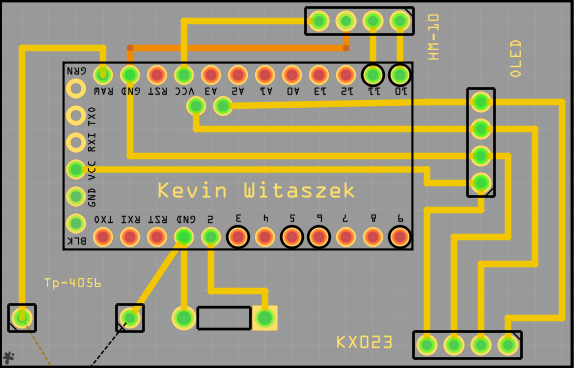
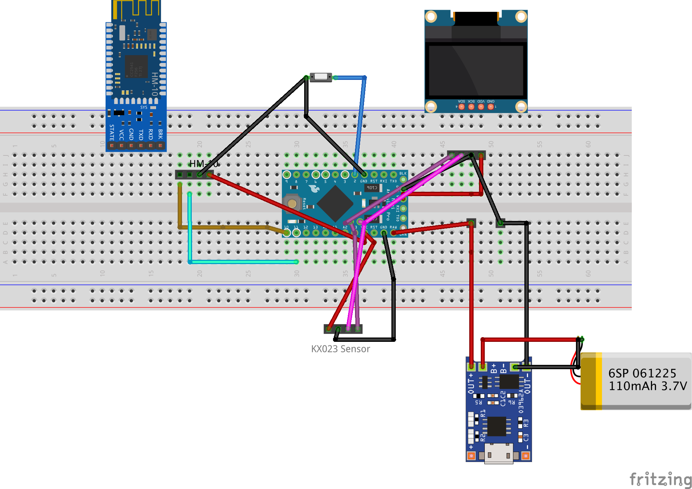

October 31th(Week 8 Blog Entry Report): During the week in class, I took my time carefully and started soldering pins onto the Arduino and the KX023 pedometer sensor:
            
                        

Next, I plugged in my Arduino to the PC using an TTL to USB Adapter to check if I am able to make a conenction between the board and the Arduino IDE. Using example sketches in Arduino IDE, I was able to confirm the connection between the two devices.I then procedded to connect my sensor onto my board to get a connection.
            
                        

Looking at the screenshot above, I was able to get values when i connected my I2C pins to the Arduino. If i disconnect the pins, the output will be -1 on all 3 axis as shown below.
            

A couple of notes to mention:
1. Before Reading week began, I had an issue with my original Arduino board(5V, 16MHz) where after connecting the power to it to see if it works, one of the capacitors blew up. While the board still works, I won't risk pushing any more damage to the board for safety reasons. I changed my board for the same arduino pro mini but for the 3.3 V 8 MHz. The reason for this change is that it will better work with the 3.7 V 250 mAh battery I have in my inventory. 
2. I updated my PCB design after finding flaws in my current design. I sent my new PCB to the prototype lab on Oct 
30th
            
3. I made additional purchases for our projects that are female header pins that will be used for soldering on my PCB.
4.The button was removed from the PCB as it will be used when we will be combing the other sensor my partner is working on.

October 15th: The PCB was designed and presented to the instructor in class:
            
                        
                                    
             The fritzting file link is here: 
                        https://github.com/kwitaszek/SmartWatch/blob/master/Documentation/SmartWatch_PCB.fzz

October 1st: The proof of payment for the smart watch project will be posted here:
            
                        
                                    
                                                
                                                            
                                                                        
                                                            
                                                                                                                     
                                                                        

September 25th: Today, I have met with our collaborator for the project and have finalized the parts that will be used in the                 project. The following list contains those parts and include their pricing:
  
            https://github.com/kwitaszek/SmartWatch/blob/master/Documentation/SmartWatchBugdet(PDF%20version).pdf   
                       
September 17th: The Estimate Project Schedule for the Smart Watch project has been uploaded to the github page:

            https://github.com/kwitaszek/SmartWatch/blob/master/Documentation/ProjectSchedule(PDF%20version).pdf
               
September 10th: The proposal and the content for the Smart Watch project were both uploaded to github page:
              
            https://github.com/kwitaszek/SmartWatch/blob/master/Documentation/ProjectProposal_TechBoys.pdf
            
September 3rd: Repository created
